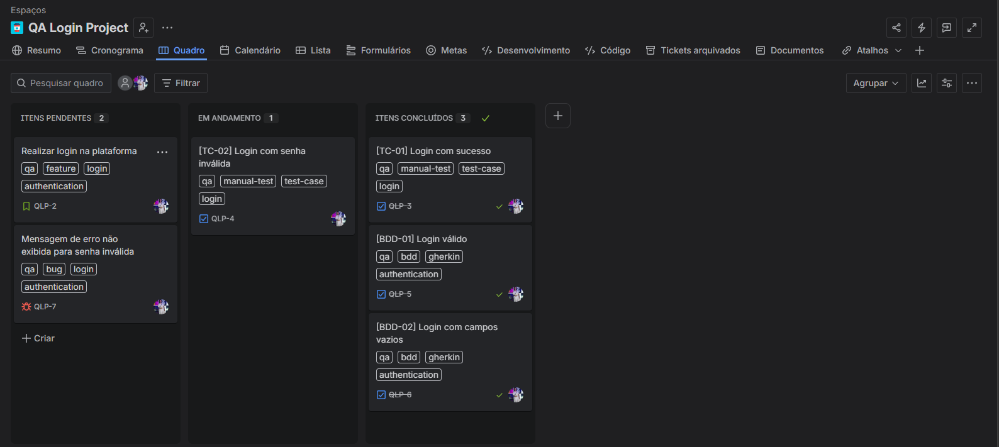
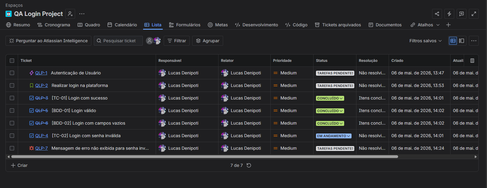
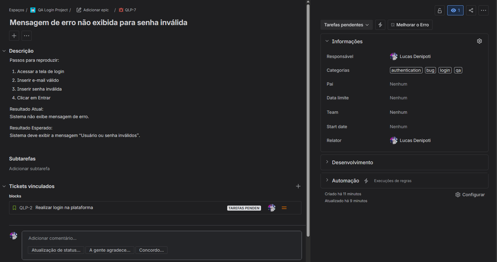

# QA Login Project

Projeto de estudo focado em planejamento e execução de testes manuais utilizando Jira Software.

---

# 📌 Objetivo

Simular um fluxo real de Quality Assurance em uma funcionalidade de autenticação/login, utilizando conceitos de:

- QA Manual
- Planejamento de testes
- BDD
- Rastreamento de issues
- Gestão de defeitos
- Organização de backlog

---

# 🧠 Escopo do Projeto

O projeto simula o fluxo de QA para uma funcionalidade de login, incluindo:

- Epic
- User Story
- Casos de teste
- Cenários BDD
- Bug report
- Organização de board
- Evidências visuais
- Rastreabilidade entre issues

---

# 🛠️ Ferramentas utilizadas

- Jira Software
- GitHub
- Markdown
- Gherkin

---

# 🚀 Fluxo utilizado

```txt
Epic
└── Story
    ├── Test Cases
    ├── BDD
    └── Bug
```

---

# 📂 Estrutura do Projeto

```txt
qa-login-project/
│
├── README.md
│
├── docs/
│   ├── README.md
│   ├── user-story.md
│   ├── plano-de-testes.md
│   ├── casos-de-teste.md
│   └── bdd.md
│
├── images/
│   ├── README.md
│   ├── jira-board.png
│   ├── jira-list.png
│   ├── epic.png
│   ├── story.png
│   ├── tc-01.png
│   ├── tc-02.png
│   ├── bdd-01.png
│   ├── bdd-02.png
│   ├── bug-report.png
│   └── mind-map.png
│
└── bdd/
    ├── README.md
    └── login.feature
```

---

# 📘 Documentação

## 📂 docs/

Contém toda a documentação funcional e técnica do projeto.

### 🔗 Acessar documentação

- [README da documentação](docs/README.md)
- [User Story](docs/user-story.md)
- [Plano de Testes](docs/plano-de-testes.md)
- [Casos de Teste](docs/casos-de-teste.md)
- [BDD](docs/bdd.md)

---

# 🥒 BDD

## 📂 bdd/

Contém os cenários escritos em Gherkin utilizados para validação comportamental da funcionalidade de login.

### 🔗 Acessar arquivos BDD

- [README BDD](bdd/README.md)
- [Arquivo login.feature](bdd/login.feature)

---

# 📸 Evidências

## 📂 images/

Contém:

- Prints do Jira
- Board
- Epic
- Story
- Casos de teste
- Cenários BDD
- Bug report
- Mind map

### 🔗 Acessar evidências

- [README das imagens](images/README.md)

---

# 📋 Jira Board

<p align="center">
  
</p>

---

# 📑 Estrutura de Tickets

<p align="center">
  
</p>

---

# 🐞 Bug Report

<p align="center">
  
</p>

---

# 🎯 Funcionalidades abordadas

- Criação de Epic e Story
- Escrita de casos de teste
- Planejamento de testes
- Gestão de defeitos
- Organização de backlog
- Rastreabilidade entre issues
- Estruturação de QA manual
- Escrita de cenários BDD

---

# 🧪 Cenários validados

- Login com sucesso
- Login com senha inválida
- Login com campos vazios
- Validação de mensagens de erro

---

# 🚀 Aprendizados

Este projeto foi desenvolvido com o objetivo de praticar:

- Fluxos de QA manual
- Organização de tarefas no Jira
- Documentação de testes
- Estruturação de backlog
- Gestão de bugs
- Escrita de cenários BDD
- Rastreabilidade entre requisitos e testes

---

# 📈 Resultado

Projeto desenvolvido como estudo prático para demonstrar organização, pensamento analítico e estruturação de testes em um fluxo semelhante ao utilizado em squads reais de desenvolvimento.
