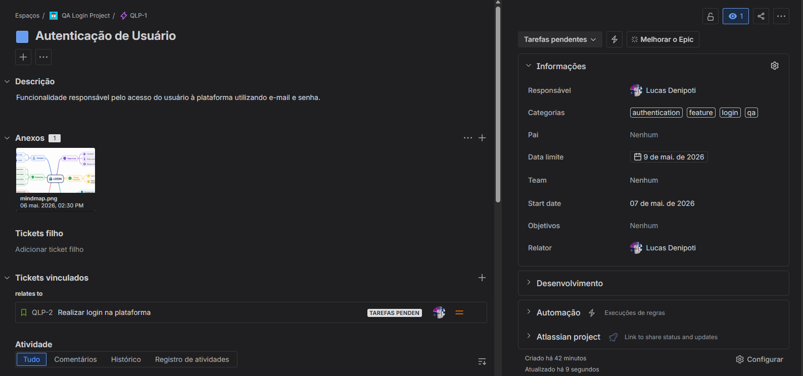
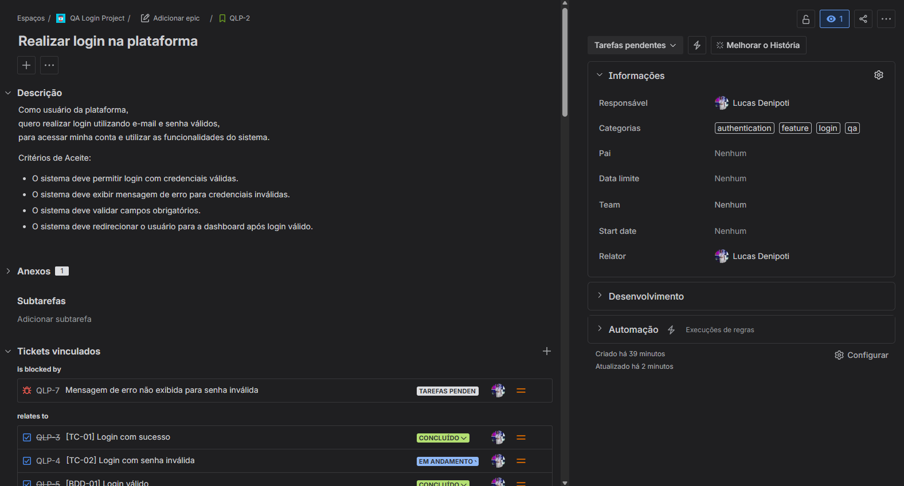
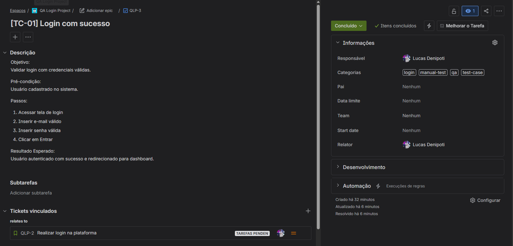
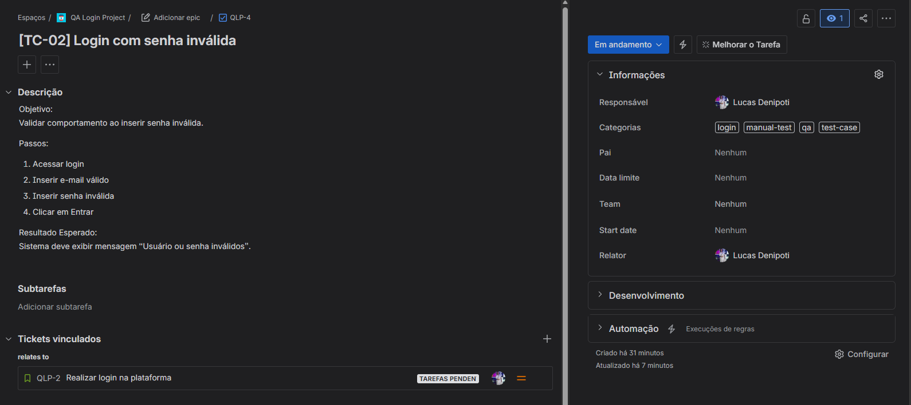
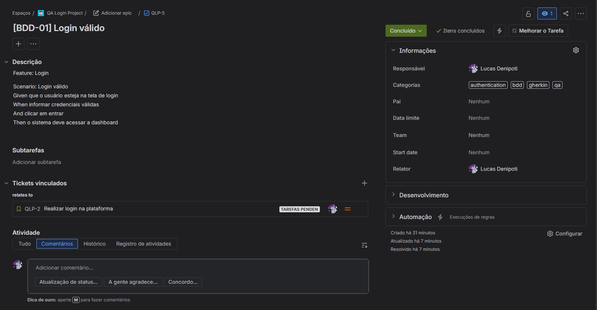
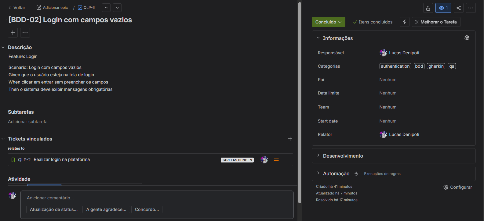

# 📸 Evidências do Projeto QA

Esta pasta contém todas as imagens e evidências utilizadas no projeto de estudo em Quality Assurance.

---

# 🗺️ Mind Map

Levantamento de requisitos e organização inicial dos testes da funcionalidade de login.

  

---

# 📋 Jira Board

Board utilizado para gerenciamento das tarefas, testes e defeitos.

  

---

# 📑 Lista de Tickets

Visualização da estrutura hierárquica entre Epic, Story, Test Cases, BDD e Bug.

  

---

# 👑 Epic

Epic criada para representar a macro funcionalidade de autenticação do sistema.

  

---

# 📘 User Story

Story contendo a necessidade do usuário e os critérios de aceite da funcionalidade.

  

---

# ✅ Test Case — Login com sucesso

Caso de teste manual validando login com credenciais válidas.

  

---

# ⚠️ Test Case — Login com senha inválida

Caso de teste manual validando o comportamento do sistema ao inserir senha incorreta.

  

---

# 🥒 BDD — Login válido

Cenário BDD escrito em Gherkin para validação do fluxo positivo de login.

  

---

# 🥒 BDD — Login com campos vazios

Cenário BDD para validação dos campos obrigatórios.

  

---

# 🐞 Bug Report

Bug criado durante a execução dos testes relacionado à ausência de mensagem de erro para senha inválida.

  

---

# 🎯 Objetivo das Evidências

Demonstrar:

- Organização de backlog
- Planejamento de testes
- Estruturação de QA manual
- Criação de cenários BDD
- Gestão de defeitos
- Rastreamento entre issues
- Fluxo de execução de testes utilizando Jira
